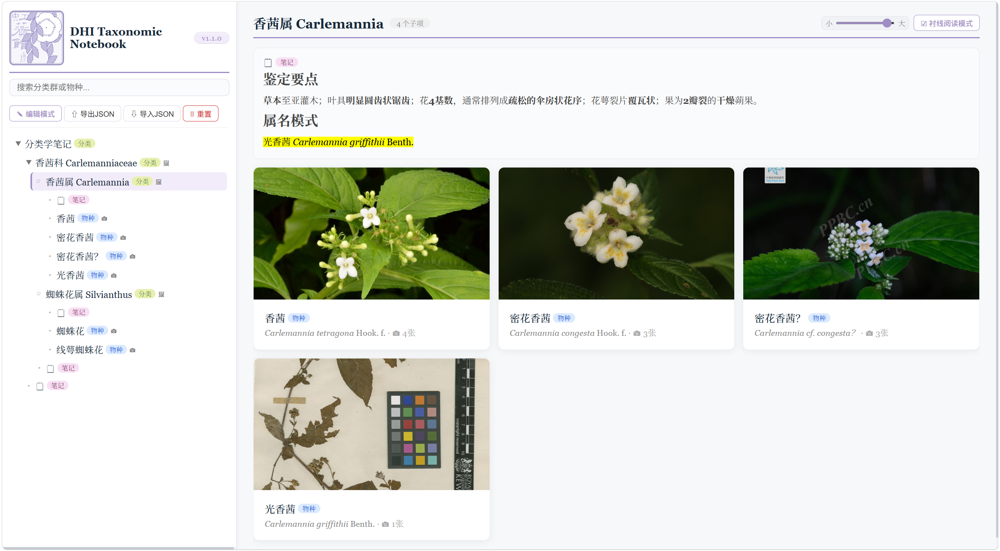
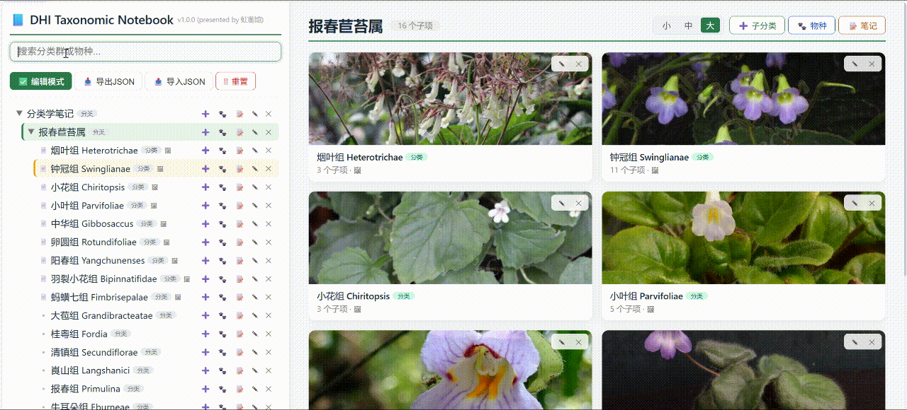
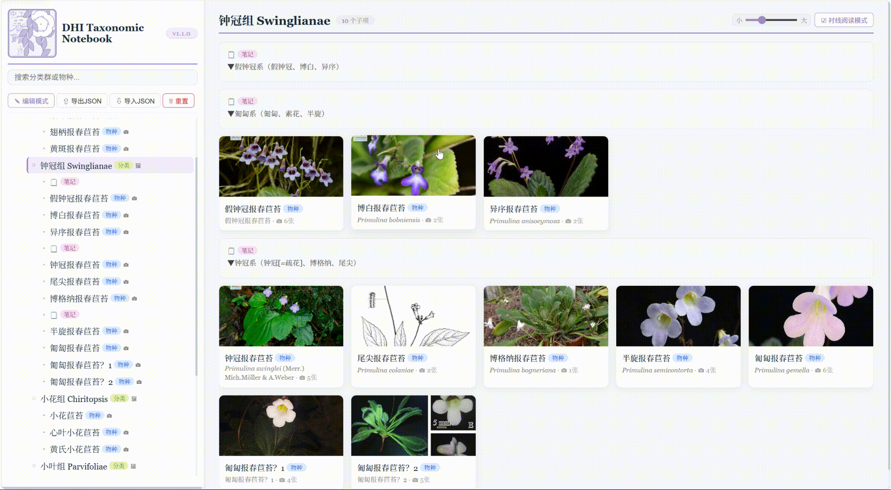
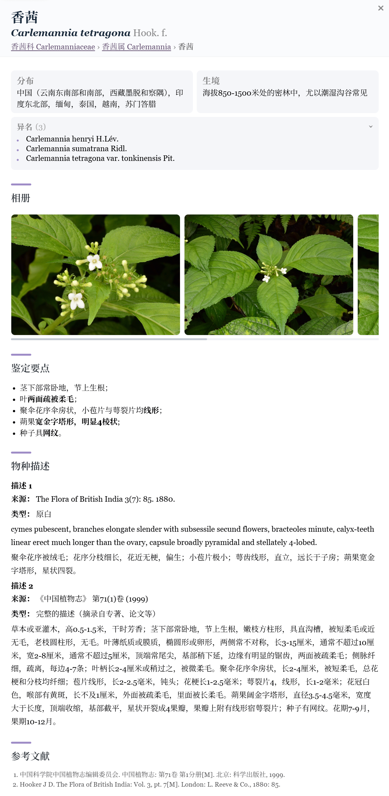

<p align="center">
  
</p>

<h1 align="center">
DHI Taxonomic Notebook / 虹蘅馆分类学笔记
</h1>

<p align="center">
 
  
  
  
  
  
</p>

<p align="center">
<b> v1.1.0</b><br>
<b> Improved Reading Experience & Taxonomic Workflow</b><br>
</p>

<p align="center">
  <a href="https://Domus-Herbarum-Iridescentium.github.io/DHI-Taxonomic-Notebook/">
    🌿 点击体验在线版！
  </a>
</p>

A lightweight, offline‑first taxonomy management tool for naturalists and taxonomists. 
 
一款专为分类学研究设计的离线知识管理工具。

---

<p align="center">
  
</p>


<p align="center">
  
</p>

## 项目简介

想系统整理一个分类群的层级关系？

想系统学习辨识属内物种？

现有笔记工具要么过于笨重，要么难以适配分类学背景？

**DHI Taxonomic Notebook**正是为此而生！

它是一款**开箱即用、纯前端、可视化**的分类学笔记工具，让您能够轻松系统构建自己的分类学笔记。

无论你是——

- **学生**：梳理课程知识，整理实习记录；

- **自然爱好者**：建立自己的物种观察笔记；

- **研究者**：为编目、专著和志书撰写积累素材；

- **团队协作者**：通过 JSON 文件共享数据，互相交流与学习；

DHI Taxonomic Notebook 都希望成为陪伴你积累分类学知识的一本数字笔记 ~

## 主要特点

### 开箱即用

仅需下载项目文件并在浏览器中打开`index.html`即可运行，无需安装、无需配置、无需服务器。

### 完全离线

所有数据（含图片）均保存在浏览器本地（IndexedDB + localStorage），无需联网，不上传任何数据。

### 分类树管理

支持创建无限层级的分类树，可自由增删分类群、物种与研究笔记，并支持跨分类拖拽整理。

### 卡片式浏览

支持积木式搭建子分类、物种与笔记卡片，支持拖拽排版与三级大小缩放。

<p align="center">
  
</p>

### 富文本研究笔记

支持 Markdown 与 HTML，可用于保存文献摘录、分类讨论、观察记录及其他研究内容。

<p align="center">
  
</p>

### 图片管理

支持 URL 导入、剪贴板粘贴、拖拽排序及大图预览；图片自动保存在本地数据库。

### 数据导入/导出
支持完整导出为 JSON 文件（含图片），支持导入恢复，方便备份、迁移与分享。

## 快速开始

> DHI Taxonomic Notebook 是一个完全离线的浏览器应用，无需安装软件，也无需服务器。

### 方法一：在线体验

[https://Domus-Herbarum-Iridescentium.github.io/DHI-Taxonomic-Notebook/](https://Domus-Herbarum-Iridescentium.github.io/DHI-Taxonomic-Notebook/)

无需安装，点击即可体验。

> Note: All data is stored locally in your browser and will not be uploaded.
>
> 注意：所有数据均保存在浏览器本地，不会上传。

---

### 方法二：直接下载（推荐）

1. 在**Releases**页面下载最新版本；

2. 解压 ZIP 压缩包；

3. 用 Chrome、Edge 或 Firefox 浏览器打开`index.html`；

4. 即刻开始使用！

---

### 方法三：Git 克隆

```bash
git clone https://github.com/Domus-Herbarum-Iridescentium/DHI-Taxonomic-Notebook.git
cd DHI-Taxonomic-Notebook
```

随后直接打开：

```text
index.html
```

即可运行。

---

### 浏览器支持

推荐使用最新版：

- ✅ Google Chrome
- ✅ Microsoft Edge
- ✅ Mozilla Firefox

不建议使用 Internet Explorer。

## 数据安全

### 本地存储

所有数据均保存在浏览器本地，不会上传到任何服务器。

- **localStorage**：保存分类树结构及所有文本内容（名称、描述、文献等），容量约 5–10 MB。
- **IndexedDB**：保存所有剪贴板粘贴的图片（Blob），容量可达数百 MB，彻底绕开 localStorage 的容量限制。

### 导出备份

点击 **“导出 JSON”** 可生成包含完整数据（树结构 + 图片）的备份文件，建议定期保存至本地或云端。

### 导入恢复

使用 **“导入 JSON”** 可将备份恢复至浏览器，支持自动检测并处理 UUID 冲突，保证数据一致性。

## 路线图

### v1.0.0

- ✅ 树状分类管理
- ✅ 卡片式浏览
- ✅ Markdown 笔记
- ✅ 图片管理（IndexedDB）
- ✅ 数据导入 / 导出（含图片）

### v1.1.0

- ✅ 编辑体验优化
- ✅ 分类路径（Breadcrumb）
- ✅ 分类群 / 物种搜索增强
- ✅ 拉丁学名与异名检索
- ✅ 图片浏览体验优化
- ✅ 异名列表管理
- ✅ 物种详情结构优化
- ✅ 阅读模式切换
- ✅ 拖拽系统优化
- ✅ 数据迁移与稳定性增强

### 后续计划

- ⏳ 分类关系（Relation）管理优化
- ⏳ 更强的高级搜索与筛选
- ⏳ 分类单元之间的引用关系
- ⏳ 更好的图片浏览
- ⏳ 文献引用管理

## 协议

本项目采用 **MIT License** 开源。

详见 [LICENSE](LICENSE)。

## 致谢

本项目使用了以下优秀的开源项目：

- **marked.js** —— Markdown 渲染
- **Sortable.js** —— 拖拽排序

示例图片来源（仅用于演示）：

- PPBC 中国植物图像库
- iNaturalist
- 其他自然爱好者与园艺社群

## 反馈

欢迎提交 **Issue** 或 **Pull Request**。

如果您发现 Bug、希望增加新功能，或有任何改进建议，都欢迎在 GitHub 中提出。

## 常见问题

### 为什么图片没有保存在 localStorage？

由于浏览器对 localStorage 容量限制较小，因此图片统一保存在 IndexedDB 中。

---

### 导出的 JSON 是否包含图片？

包含。

导出时会自动将 IndexedDB 中的图片编码并写入 JSON，因此一个文件即可完整备份。

---

### 是否需要联网？

不需要。

本工具完全离线运行。

---

### 是否支持移动端？

支持浏览和基础编辑，但建议使用桌面浏览器获得最佳体验。

---

<p align="center">
<b>Happy botanizing! 🌿</b><br>
</p>

<p align="center">
  
</p>
